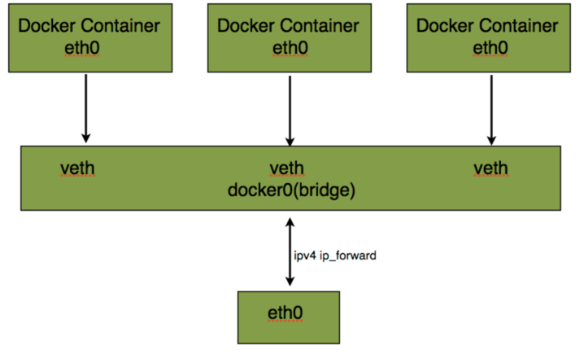
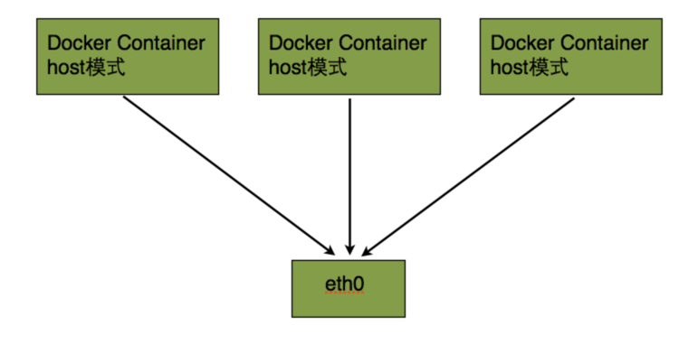

# docker network
- bridge: The default network driver. If you don’t specify a driver, this is the type of network you are creating. Bridge networks are usually used when your applications run in standalone containers that need to communicate.
  Best when you need multiple containers to communicate on the same Docker host.
  
- host: For standalone containers, remove network isolation between the container and the Docker host, and use the host’s networking directly.
  Best when the network stack should not be isolated from the Docker host, but you want other aspects of the container to be isolated。
  Best when only run a little fat container in the host.
  A machine has started multiple identical thin containers, which is very likely to cause port conflicts. In this scenario, the host mode is not applicable.
  
- overlay: Overlay networks connect multiple Docker daemons together and enable swarm services to communicate with each other. You can also use overlay networks to facilitate communication between a swarm service and a standalone container, or between two standalone containers on different Docker daemons. This strategy removes the need to do OS-level routing between these containers. See overlay networks.
  Best when you need containers running on different Docker hosts to communicate, or when multiple applications work together using swarm services.
- macvlan: Macvlan networks allow you to assign a MAC address to a container, making it appear as a physical device on your network. The Docker daemon routes traffic to containers by their MAC addresses. Using the macvlan driver is sometimes the best choice when dealing with legacy applications that expect to be directly connected to the physical network, rather than routed through the Docker host’s network stack. See Macvlan networks.
  Best when you are migrating from a VM setup or need your containers to look like physical hosts on your network, each with a unique MAC address
- none: For this container, disable all networking. Usually used in conjunction with a custom network driver. none is not available for swarm services. See disable container networking.

- Network plugins: You can install and use third-party network plugins with Docker. These plugins are available from Docker Hub or from third-party vendors. See the vendor’s documentation for installing and using a given network plugin.

