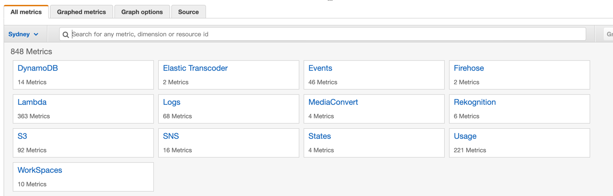

# Concept

## CloudWatch 是什么？ 我们为什么要使用 CloudWatch
- Amazon CloudWatch 会监控您的 AWS 资源以及您在上运行的应用程序。
- 可以使用 CloudWatch 收集和跟踪指标，这些指标是您可衡量的相关资源和应用程序的变量。
- 通过 CloudWatch，您可以在全面地了解资源使用率、应用程序性能和运行状况.

## CloudWatch Metrics
### CloudWatch 中的 metrics 是什么？
- Metrics are data about the performance of your systems.
### 包含哪些种类

### 如何使用
- By default, many services provide free metrics for resources
- You can also enable detailed monitoring for some resources, 
  such as your Amazon EC2 instances, or publish your own 
  application metrics
  
- Amazon CloudWatch can load all the metrics in your account 
  (both AWS resource metrics and application metrics that you provide) 
  for search, graphing, and alarms.
  
## CloudWatch Events
- CloudWatch Events is now Amazon EventBridge
- Amazon EventBridge 是一个无服务器事件总线服务，您可以使用它将应用与来自各种资源的数据连接起来
- [What Is Amazon EventBridge](https://docs.aws.amazon.com/eventbridge/latest/userguide/eb-what-is.html)


# 使用
## publish custom metric
- [Publishing custom metrics](https://docs.aws.amazon.com/AmazonCloudWatch/latest/monitoring/publishingMetrics.html)
- use aws-cli  
  要进行本地授权
  ```shell
  aws cloudwatch put-metric-data --metric-name CXCMetric --namespace CXCNameSpace --unit Bytes --value 231434333 --dimensions FunctionName=my-lambda-cxc --region ap-southeast-2
  ```
 
