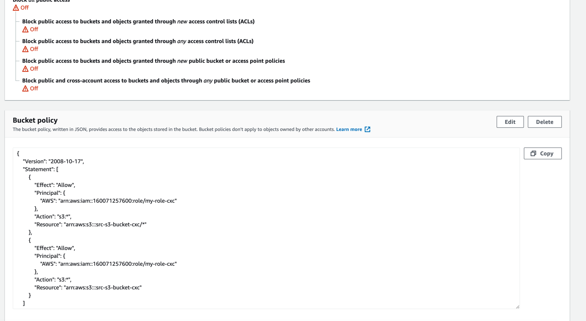

# IAM ROLE
- [AWS::IAM::Role](https://docs.aws.amazon.com/zh_cn/AWSCloudFormation/latest/UserGuide/aws-resource-iam-role.html#cfn-iam-role-managepolicyarns)

# CloudWatch Event
- [AWS::Events::Rule](https://docs.aws.amazon.com/zh_cn/AWSCloudFormation/latest/UserGuide/aws-resource-events-rule.html)

# S3 bucket policy
- [AWS::S3::BucketPolicy](https://docs.aws.amazon.com/AWSCloudFormation/latest/UserGuide/aws-properties-s3-policy.html)
- 此处的 cloudformation 中的 BucketPolicy 对应 s3 中的 BucketPolicy
- 

# 内部函数
- [Fn::Sub Fn::GetAtt Ref 等](https://docs.aws.amazon.com/zh_cn/AWSCloudFormation/latest/UserGuide/intrinsic-function-reference-sub.html)

# CloudWatch custom Metrics
- [Publishing custom metrics](https://docs.aws.amazon.com/AmazonCloudWatch/latest/monitoring/publishingMetrics.html)

