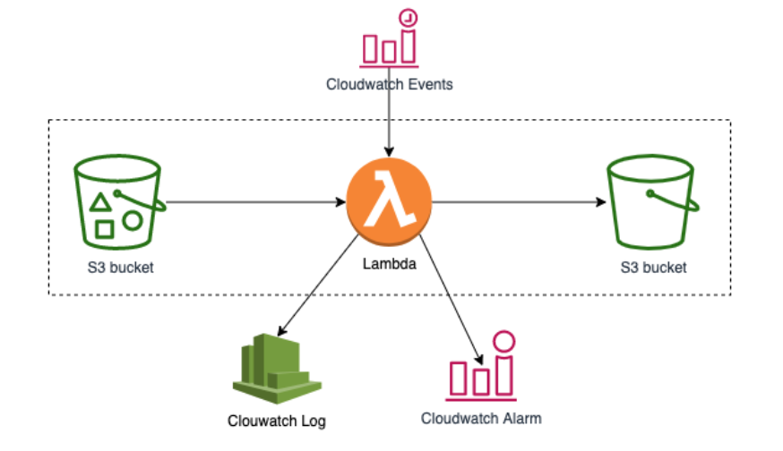

# Serverless
[serverless](https://aws.amazon.com/cn/serverless/)  
Serverless is a cloud-native development model that allows developers 
to build and run applications without having to manage servers.

There are still servers in serverless, but they are abstracted away from 
app development. A cloud provider handles the routine work of provisioning, 
maintaining, and scaling the server infrastructure. Developers can simply 
package their code in containers for deployment.

Once deployed, serverless apps respond to demand and automatically scale up and 
down as needed. Serverless offerings from public cloud providers are usually 
metered on-demand through an event-driven execution model. As a result, 
when a serverless function is sitting idle, it doesn’t cost anything.

# Use aws cli create lambda
[Use aws cli create lambda](doc/aws-cli-create-lambda.md)

# CloudFormation
[Use CloudFormation create lambda](doc/CloudFromation.md)

# System

  

[System Create](doc/lambda.md)

# Q&A
[QA](doc/QA.md)