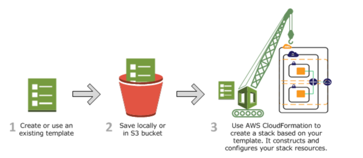

# Concepts
## Template
- AWS CloudFormation 会在配置模板中描述资源
- 可在本地或在 S3 存储桶中保存模板  
  如果创建了一个模板，可使用文件扩展名（如 .json、.yaml 或 .txt）保存该模板  
  通过指定模板文件的位置（例如，本地计算机上的路径或 Amazon S3 URL）来创建 CloudFormation 堆栈。  
  如果模板包含参数，则可在创建堆栈时指定输入值。利用参数，您能够将值传入模板，以便能在创建堆栈时自定义资源。
- 如果指定在本地存储的模板文件，则 AWS CloudFormation 将该文件上传到您的 AWS 账户的 S3 存储桶中  
  AWS CloudFormation 为每个区域创建一个存储桶以上传模板文件。在您的 AWS 账户中具有 S3 权限的任何人都可以访问存储桶。
  如果 AWS CloudFormation 创建的存储桶已存在，则将模板添加到该存储桶。
  
- 可通过手动将模板上传到 Amazon S3 来使用您自己的存储桶并管理其权限。  
  之后，当您创建或更新堆栈时，请指定模板文件的 Amazon S3 URL

## Stacks
- 当您创建堆栈时，AWS CloudFormation 会配置模板中描述的资源。
- 当您创建堆栈时，还可以指定 AWS CloudFormation 用来创建模板中描述的任何项的模板。
- 可通过创建、更新和删除堆栈来创建、更新和删除一组资源。堆栈中的所有资源均由堆栈的 AWS CloudFormation 模板定义
- 可通过使用 AWS CloudFormation [控制台](https://ap-southeast-2.console.aws.amazon.com/cloudformation/home?region=ap-southeast-2#/stacks?filteringStatus=active&filteringText=&viewNested=true&hideStacks=false) 、
  API 或 AWS CLI 来使用堆栈。
  
- [参考链接](https://docs.aws.amazon.com/zh_cn/AWSCloudFormation/latest/UserGuide/cfn-whatis-concepts.html#w2aab5c15b9)
### CloudFormation create stacks workflow

## Change sets
- 如果您需要更改堆栈中运行的资源，则可更新堆栈。在更改资源之前，您可以生成一个更改集，
  这是建议进行的更改的摘要。利用更改集，您可以在实施更改之前，了解更改可能会对运行的
  资源 (特别是关键资源) 造成的影响。
  
- 使用更改集更新堆栈  
  [参考链接](https://docs.aws.amazon.com/zh_cn/AWSCloudFormation/latest/UserGuide/cfn-whatis-howdoesitwork.html)
  
# create lambda
- create a template .
- 打开 CloudFormation console
- create stacks .
- my-lambda-stack-cxc
