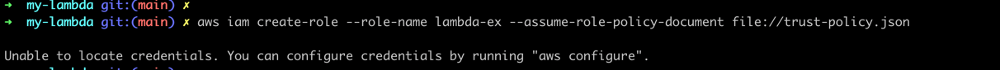
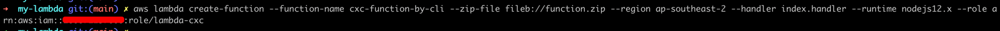

## create role fail
- no local credentials  

  
- use saml2aws add local credentials
  

## use cli create function error
- no region  
  
  
## lambda function copy file from one s3 to another s3 fail
- lambda function no access permission to s3.
