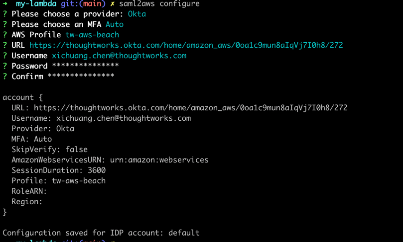
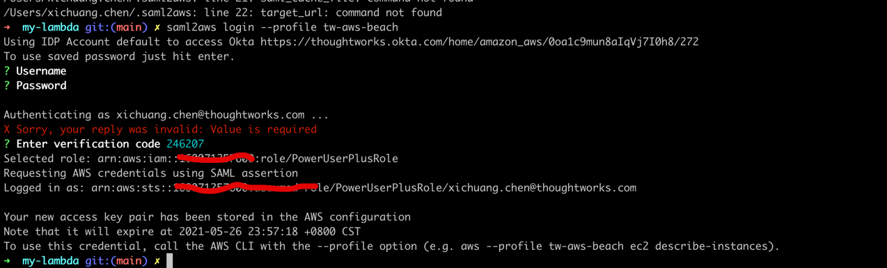
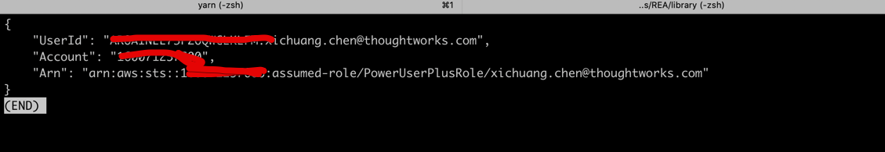
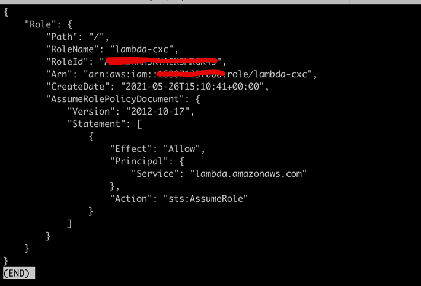
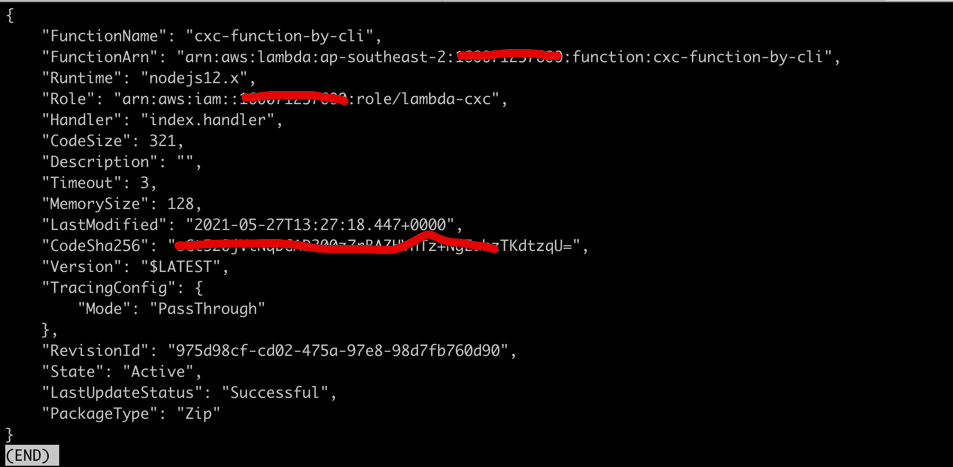

# aws cli
## use saml2aws create local credential
- brew install saml2aws
  
- [saml2aws Doc](https://github.com/Versent/saml2aws)
- saml2aws configure  
  
- saml2aws configure info at ~/.saml2aws
- login  
  saml2aws login --profile tw-aws-beach
  
  
- export AWS_PROFILE=tw-aws-beach  
  aws sts get-caller-identity --profile tw-aws-beach

  

## use aws cli create role and function
[use aws cli create role and function](https://docs.aws.amazon.com/zh_cn/lambda/latest/dg/gettingstarted-awscli.html)
### create role
- aws iam create-role --role-name lambda-cxc --assume-role-policy-document file://trust-policy.json

  
### create lambda function use cli
- touch index.js
- copy code into index.js
  
- zip function.zip index.js
- 使用 create-function 命令创建 Lambda 函数。将角色 ARN 中突出显示的文本替换为您的账户 ID  
`aws lambda create-function --function-name cxc-function-by-cli \
  --zip-file fileb://function.zip --handler index.handler --runtime nodejs12.x \
  --role arn:aws:iam::1600****7600:role/lambda-cxc --region=ap-southeast-2`  
  